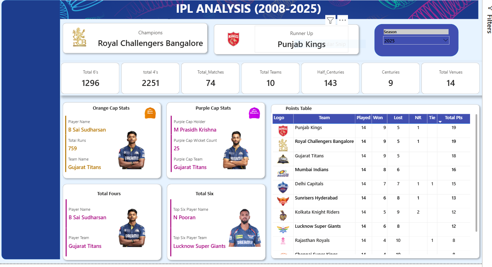

# 🏏 IPL Power BI Dashboard (2008–2025)  

This is an interactive **Power BI Dashboard** that I built to analyze the Indian Premier League (IPL) across all seasons from **2008 to 2025**. It is built using historical IPL datasets.  
The goal is to explore and visualize IPL insights such as **Orange Cap, Purple Cap, team performance, runs, wickets, sixes, fours, points table, and season champions**.  

---

The idea was simple:  
I wanted to bring together all those raw CSV files of ball-by-ball data, match results, player stats, and team info — and turn them into a visually appealing, insight-driven story about the IPL.  

The dashboard helps answer questions like:
- Who scored the most runs (Orange Cap)?  
- Who took the most wickets (Purple Cap)?  
- How many sixes and fours were smashed this season?  
- Which teams dominated the points table?  
- And of course — who lifted the 🏆 and who ended up runner-up?  

---

## 📂 Dataset  

The dashboard is based on four datasets:  

1. **`ball_by_ball_data.csv`**  
   - Ball-level match details (runs, wickets, extras, sixes, fours).  
   - Core source for player batting & bowling stats.  

2. **`ipl_matches_data.csv`**  
   - Match-level details (season, venue, teams, winner, player of match).  
   - Used for results, champions, and venue insights.  

3. **`players-data-updated.csv`**  
   - Player info (ID, name, batting/bowling style, team).  
   - Used for linking performance to specific players.  

4. **`teams_data.csv`**  
   - Team info (ID, team name, short name).  
   - Used for team-level analysis and joins.  

---

### 🔎 Data Cleaning & Transformation (Power Query)  
- Removed duplicates and handled null values.  
- Standardized team and player names.  
- Created calculated columns for **half-centuries, centuries, boundaries**.  
- Built relationships between fact and dimension tables.  
- Extracted KPIs like **total matches, venues, and season outcomes**.  

---

## 📊 Dashboard Overview  

The dashboard includes the following visuals & KPIs:  

- **KPI Cards**  
  - Total 6s, Total 4s, Matches Played, Teams, Half-Centuries, Centuries, Venues  

- **Player Stats**  
  - Orange Cap: Top run scorer of the season  
  - Purple Cap: Top wicket taker of the season  
  - Most Fours & Sixes by individual players  

- **Team Stats**  
  - Points Table: Matches played, won, lost, ties, NR, and total points  
  - Champions & Runner-Up for each season  

- **Filters**  
  - Season Selector (2008–2025)  

---

## 🚀 Insights (Example: 2025 Season)  
- **B Sai Sudharsan** scored **759 runs** to win the **Orange Cap**.  
- **M Prasidh Krishna** took **25 wickets** to win the **Purple Cap**.  
- **Nicholas Pooran** hit the most sixes.  
- **Royal Challengers Bangalore** finally lifted the trophy 🏆, with **Punjab Kings** as runner-up.  
- A total of **1296 sixes** and **2251 fours** were smashed in the 2025 season.  
- IPL continues to grow, with **10 teams** competing across **14 venues**.  

---

## 🛠️ Tools Used  
- **Power BI** → Dashboard & Visualizations  
- **Power Query** → Data Cleaning & Transformation  
- **DAX** → Custom Measures (Orange Cap, Purple Cap, KPIs, Points Table)  
- **CSV Datasets** → IPL Data (Ball-by-Ball, Matches, Players, Teams)  

---

## 📸 Dashboard Preview  
  

---

## 📌 How to Use  
1. Clone or download this repository.  
2. Load the CSV files (`ball_by_ball_data.csv`, `ipl_matches_data.csv`, `players-data-updated.csv`, `teams_data.csv`) into Power BI.  
3. Open the Power BI file (`IPL_Dashboard.pbix`).  
4. Explore the interactive visuals — filter by season, team, or player to uncover insights.  

---

## ✨ Author  
👤 **[Sarika Verma]**  
📧 *sarika261028@gmail.com*  
🔗 *[www.linkedin.com/in/akasarikaverma]*  

---

⚡ If you’re a cricket fan like me, dive in and explore the IPL story through data! 

